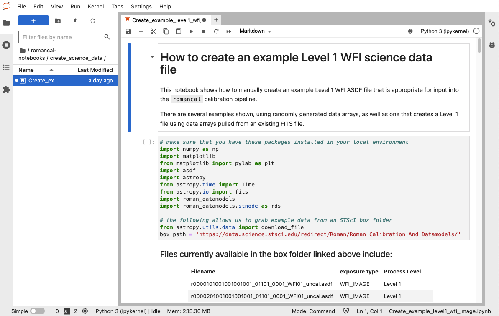
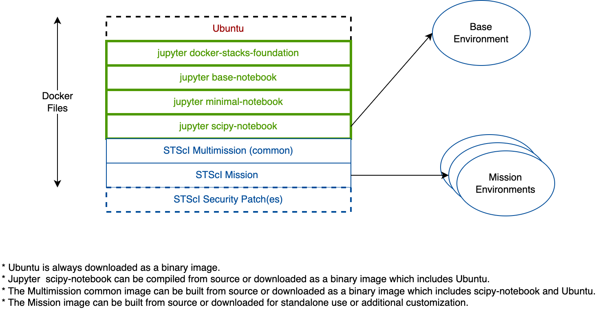

## STScI JupyterHub Science Platforms Docker Images

### Overview

The Space Telescope Science Institute
([STScI](https://www.stsci.edu/)) provides JupyterHub-based science
platforms for community use.  These web-based platforms offer software
and tools to perform analysis and processing of astronomical data in a JupyterLab environment.

This repo defines the Docker images used to support single user JupyterHub notebook servers.  The images are currently based on the community [jupyter/docker-stacks](https://github.com/jupyter/docker-stacks)
 project as well as prior STScI JupyterHub efforts.

Each image defines a [JupyterLab](https://jupyter.org/) environment which includes one or more Python kernels dedicated to astronomical processing and/or generic data analysis.

These images can be run locally on your laptop or as notebook servers for one of STScI's cloud-based multi-user jupyterhubs.

Make sure you budget enough RAM and Disk space for your docker daemon, we typically use 16GB RAM and 200GB Disk.



### Supported Missions

While there are commonalities, each mission has a different selection of
available s/w.

#### Currently supported missions/deployments:

- roman
- tike
- jwebbinar

#### Future missions/deployments:

- jwst

### Prerequisites

Using this build framework requires installation of some basic tools:

1. Docker

2. Miniconda and the repo's requirements.txt

For Docker on x86 based OS-X we now typically use colima installed via brew.

### Building an image

Image building is scripted in bash to make builds relatively straight-forward while meeting other goals.

To do a personal image build, from the top directory of a repo clone you can
e.g.:

```
scripts/image-configure  roman

source setup-env

image-build

image-test   # to run built-in mission-specific headless tests

run-lab      # to run JupyterLab single user on your local computer
```


---
### Image Structure

The diagram below illustrates the general structure of these images:



Starting from an Ubuntu base image, a chain of 7 Dockerfiles is used to build the final product.  Optional patch layers can be added later to address specific security concerns w/o rebuilding the entire image.

---

### Why there is no single Dockerfile

The images are construcuted to meet multi-mission goals:

1. Incorporates SSL certs needed to support builds within the confines of STScI's AWS platforms.

2. Uses community jupyter/docker-stacks Dockerfiles defined on GitHub to provide a solid JupyterLab baseline pacing current community development.

3. Adds common multi-mission packages, scripts, and configuration.

4. Supports the definition of multiple mission-specific Python kernels per image and arbitrary mission-specific software.

### Why commands are scripted vs. inlined

1. Standardizes the installation and cleanup for Python conda, pip, and npm package environments ensuring minimal image size and consistent installation.  Separates installation details from package lists and version constraints making it easier to focus on each individually.

2. Supports the use of multiple requirements files enabling a mix of tightly prescribed and add-on requirements without re-writing any of the original package lists.

3. Saves overall kernel/environment package version and dependency solutions to make precise rebuilds of Python environments possible later.    Flip a switch and the same scripts which install loose requirements can re-install their saved version solutions enabling accurate reconstruction of mission environments.

4. Supports easy definition of per-kernel automated import and notebook tests and implicit conversion of conda environments to jupyter kernels.

### More documentation

More details on the source code layout and available scripts are in the `doc` directory.

In short,  Dockerfiles and package lists are defined in the `deployments` subdirectory tree.

Build scripts for the host computer are defined in the `scripts` directory.
